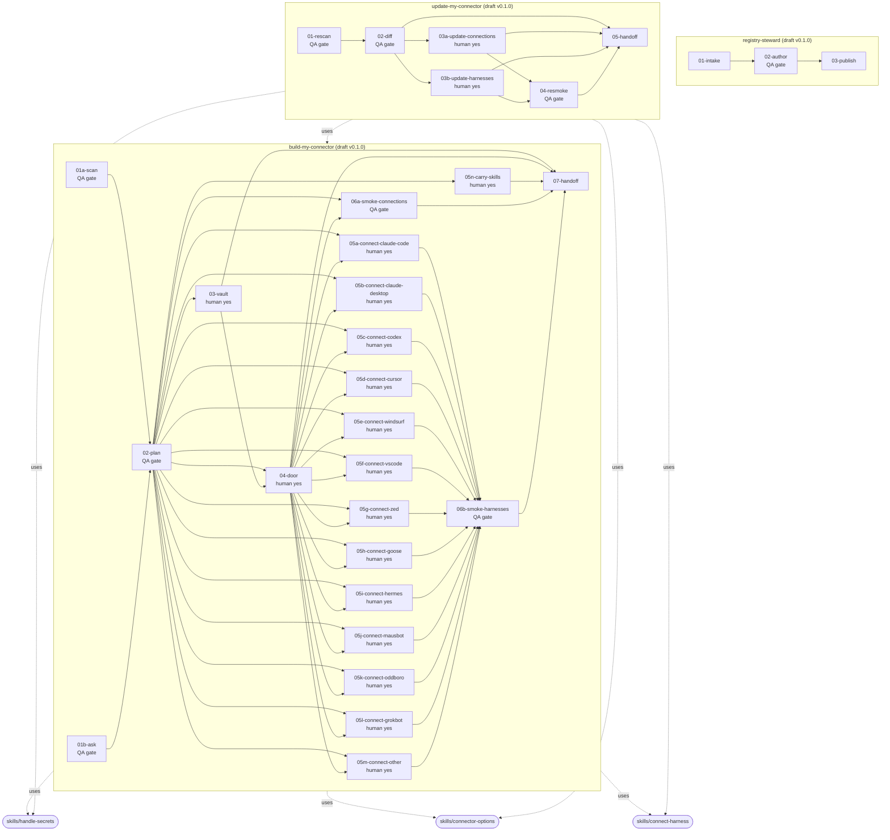

# Process graph

Generated by `tools/graph.py` from every `process.yaml`. Do not edit by hand.

```mermaid
flowchart TD
  subgraph rb__build_my_connector["build-my-connector (draft v0.1.0)"]
    build_my_connector__01a_scan["01a-scan<br/>QA gate"]
    build_my_connector__01b_ask["01b-ask<br/>QA gate"]
    build_my_connector__02_plan["02-plan<br/>QA gate"]
    build_my_connector__03_vault["03-vault<br/>human yes"]
    build_my_connector__04_door["04-door<br/>human yes"]
    build_my_connector__05a_connect_claude_code["05a-connect-claude-code<br/>human yes"]
    build_my_connector__05b_connect_claude_desktop["05b-connect-claude-desktop<br/>human yes"]
    build_my_connector__05c_connect_codex["05c-connect-codex<br/>human yes"]
    build_my_connector__05d_connect_cursor["05d-connect-cursor<br/>human yes"]
    build_my_connector__05e_connect_windsurf["05e-connect-windsurf<br/>human yes"]
    build_my_connector__05f_connect_vscode["05f-connect-vscode<br/>human yes"]
    build_my_connector__05g_connect_zed["05g-connect-zed<br/>human yes"]
    build_my_connector__05h_connect_goose["05h-connect-goose<br/>human yes"]
    build_my_connector__05i_connect_hermes["05i-connect-hermes<br/>human yes"]
    build_my_connector__05j_connect_mausbot["05j-connect-mausbot<br/>human yes"]
    build_my_connector__05k_connect_oddboro["05k-connect-oddboro<br/>human yes"]
    build_my_connector__05l_connect_grokbot["05l-connect-grokbot<br/>human yes"]
    build_my_connector__05m_connect_other["05m-connect-other<br/>human yes"]
    build_my_connector__05n_carry_skills["05n-carry-skills<br/>human yes"]
    build_my_connector__06a_smoke_connections["06a-smoke-connections<br/>QA gate"]
    build_my_connector__06b_smoke_harnesses["06b-smoke-harnesses<br/>QA gate"]
    build_my_connector__07_handoff["07-handoff"]
  end
  subgraph rb__registry_steward["registry-steward (draft v0.1.0)"]
    registry_steward__01_intake["01-intake"]
    registry_steward__02_author["02-author<br/>QA gate"]
    registry_steward__03_publish["03-publish"]
  end
  subgraph rb__update_my_connector["update-my-connector (draft v0.1.0)"]
    update_my_connector__01_rescan["01-rescan<br/>QA gate"]
    update_my_connector__02_diff["02-diff<br/>QA gate"]
    update_my_connector__03a_update_connections["03a-update-connections<br/>human yes"]
    update_my_connector__03b_update_harnesses["03b-update-harnesses<br/>human yes"]
    update_my_connector__04_resmoke["04-resmoke<br/>QA gate"]
    update_my_connector__05_handoff["05-handoff"]
  end
  skill__connect_harness(["skills/connect-harness"])
  skill__connector_options(["skills/connector-options"])
  skill__handle_secrets(["skills/handle-secrets"])
  build_my_connector__01a_scan --> build_my_connector__02_plan
  build_my_connector__01b_ask --> build_my_connector__02_plan
  build_my_connector__02_plan --> build_my_connector__03_vault
  build_my_connector__02_plan --> build_my_connector__04_door
  build_my_connector__03_vault --> build_my_connector__04_door
  build_my_connector__02_plan --> build_my_connector__05a_connect_claude_code
  build_my_connector__04_door --> build_my_connector__05a_connect_claude_code
  build_my_connector__02_plan --> build_my_connector__05b_connect_claude_desktop
  build_my_connector__04_door --> build_my_connector__05b_connect_claude_desktop
  build_my_connector__02_plan --> build_my_connector__05c_connect_codex
  build_my_connector__04_door --> build_my_connector__05c_connect_codex
  build_my_connector__02_plan --> build_my_connector__05d_connect_cursor
  build_my_connector__04_door --> build_my_connector__05d_connect_cursor
  build_my_connector__02_plan --> build_my_connector__05e_connect_windsurf
  build_my_connector__04_door --> build_my_connector__05e_connect_windsurf
  build_my_connector__02_plan --> build_my_connector__05f_connect_vscode
  build_my_connector__04_door --> build_my_connector__05f_connect_vscode
  build_my_connector__02_plan --> build_my_connector__05g_connect_zed
  build_my_connector__04_door --> build_my_connector__05g_connect_zed
  build_my_connector__02_plan --> build_my_connector__05h_connect_goose
  build_my_connector__04_door --> build_my_connector__05h_connect_goose
  build_my_connector__02_plan --> build_my_connector__05i_connect_hermes
  build_my_connector__04_door --> build_my_connector__05i_connect_hermes
  build_my_connector__02_plan --> build_my_connector__05j_connect_mausbot
  build_my_connector__04_door --> build_my_connector__05j_connect_mausbot
  build_my_connector__02_plan --> build_my_connector__05k_connect_oddboro
  build_my_connector__04_door --> build_my_connector__05k_connect_oddboro
  build_my_connector__02_plan --> build_my_connector__05l_connect_grokbot
  build_my_connector__04_door --> build_my_connector__05l_connect_grokbot
  build_my_connector__02_plan --> build_my_connector__05m_connect_other
  build_my_connector__04_door --> build_my_connector__05m_connect_other
  build_my_connector__02_plan --> build_my_connector__05n_carry_skills
  build_my_connector__02_plan --> build_my_connector__06a_smoke_connections
  build_my_connector__04_door --> build_my_connector__06a_smoke_connections
  build_my_connector__05a_connect_claude_code --> build_my_connector__06b_smoke_harnesses
  build_my_connector__05b_connect_claude_desktop --> build_my_connector__06b_smoke_harnesses
  build_my_connector__05c_connect_codex --> build_my_connector__06b_smoke_harnesses
  build_my_connector__05d_connect_cursor --> build_my_connector__06b_smoke_harnesses
  build_my_connector__05e_connect_windsurf --> build_my_connector__06b_smoke_harnesses
  build_my_connector__05f_connect_vscode --> build_my_connector__06b_smoke_harnesses
  build_my_connector__05g_connect_zed --> build_my_connector__06b_smoke_harnesses
  build_my_connector__05h_connect_goose --> build_my_connector__06b_smoke_harnesses
  build_my_connector__05i_connect_hermes --> build_my_connector__06b_smoke_harnesses
  build_my_connector__05j_connect_mausbot --> build_my_connector__06b_smoke_harnesses
  build_my_connector__05k_connect_oddboro --> build_my_connector__06b_smoke_harnesses
  build_my_connector__05l_connect_grokbot --> build_my_connector__06b_smoke_harnesses
  build_my_connector__05m_connect_other --> build_my_connector__06b_smoke_harnesses
  build_my_connector__03_vault --> build_my_connector__07_handoff
  build_my_connector__04_door --> build_my_connector__07_handoff
  build_my_connector__05n_carry_skills --> build_my_connector__07_handoff
  build_my_connector__06a_smoke_connections --> build_my_connector__07_handoff
  build_my_connector__06b_smoke_harnesses --> build_my_connector__07_handoff
  rb__build_my_connector -. uses .-> skill__handle_secrets
  rb__build_my_connector -. uses .-> skill__connector_options
  rb__build_my_connector -. uses .-> skill__connect_harness
  registry_steward__01_intake --> registry_steward__02_author
  registry_steward__02_author --> registry_steward__03_publish
  update_my_connector__01_rescan --> update_my_connector__02_diff
  update_my_connector__02_diff --> update_my_connector__03a_update_connections
  update_my_connector__02_diff --> update_my_connector__03b_update_harnesses
  update_my_connector__03a_update_connections --> update_my_connector__04_resmoke
  update_my_connector__03b_update_harnesses --> update_my_connector__04_resmoke
  update_my_connector__02_diff --> update_my_connector__05_handoff
  update_my_connector__03a_update_connections --> update_my_connector__05_handoff
  update_my_connector__03b_update_harnesses --> update_my_connector__05_handoff
  update_my_connector__04_resmoke --> update_my_connector__05_handoff
  rb__update_my_connector -. uses .-> skill__handle_secrets
  rb__update_my_connector -. uses .-> skill__connector_options
  rb__update_my_connector -. uses .-> skill__connect_harness
  rb__update_my_connector -. uses .-> rb__build_my_connector
```
